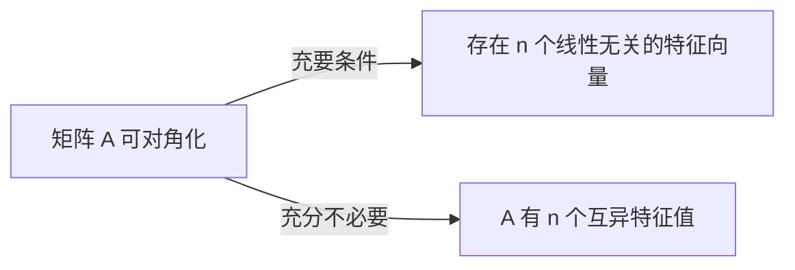

# 笔记模板与写作细则

生成课程笔记前按本文件执行；与 SKILL.md 冲突时以 SKILL.md 为准。学科特殊要求另见 subject-playbooks.md。

## 1. 完整模板

默认骨架是**速览 → 标题 + 知识点 → 易错点 → 公式速查表**四段；材料信息不足时裁剪对应小节；**例题解答、证明过程、课后练习默认不写**（SKILL.md 规则 8）。"课后自测""待确认"为可选小节，只在用户要求或有实际待确认内容时出现（"待确认"没有内容时写"（无）"或整节省略均可）。

```markdown
# <课程名> · <主题>

> **本讲速览**：一段话说清这一讲讲了什么、解决什么问题、在整个课程里的位置。
> **关键词**：A（term A）、B（term B）、C

## 1 <沿用材料的章节编号与标题>
- **定义/概念**加粗给出，后接解释与直观理解
- 公式用 LaTeX（见 §3）；定理只写"条件 → 结论 → 直观理解"，不写证明
- 方法/步骤压成可执行要点；方法可复用的例题只记一句话（见 §4）

（图：默认重绘，图注 + 解读，见 §5）

## 易错点与考点
- ❌ 错误做法 → ✅ 正确做法 → 一句话原因
- 标注哪些是常考点（材料明示或题设暗示时才标，不编造考频）

## 公式/结论速查表
| 名称 | 表达式 | 适用条件 |

## 课后自测（仅当用户要求时出现）
1. 针对核心概念的问题
   <details><summary>答案</summary>一句话答案 + 对应小节号</details>

## 待确认（仅当有待确认内容时出现）
- 第 N 张图右下角公式被手挡住，无法辨认，请补拍
```

## 2. 标题与编号

- 正文小节沿用材料自己的章节编号（`## 3.2 泰勒公式`），便于对照原教材；材料没有编号时按知识点重新编号。
- "易错点与考点""速查表"固定为顶级小节，放正文之后；"课后自测""待确认"为可选小节，按需出现。
- 标题里不出现"小结""（续）"这类无信息量的词。

## 3. 公式

- 行内 `$...$`，独立成行用 `$$...$$`；多行推导用 `$$\begin{aligned} ... \end{aligned}$$`。
- 每个重要公式后括注各符号含义与适用条件；符号含义在首次出现处说明一次即可。
- 材料里手写潦草的公式，先转写成 LaTeX 再核对结构（上下标、求和限、积分限），拿不准的进"待确认"。

## 4. 例题与证明（默认不写入）

- 例题解答、定理证明、教材练习**默认不录入**；定理只保留"条件 → 结论 → 直观理解（→ 反例/易错）"。
- 例题的方法可复用且知识点未覆盖时，压成一句"方法要点"附在对应小节；纯代入计算任何时候都不写。
- 仅当用户明确要求例题或证明（或 subject-playbooks 对应学科另有规定）时，才按"题目一句话 → 方法 → 关键步骤（每步标注依据）→ 结论"写入；证明不省关键转折步。

## 5. 图片细则

### 5.1 assets 命名与引用

- 文件名 `NN-描述.png`，`NN` 为按出现顺序的两位编号（`01`、`02`…），描述用中文短横线连接：`03-特征值几何意义.png`。
- 引用一律用相对路径：``。
- 先复制/生成文件，再写引用；交付前按 SKILL.md 校验清单核对路径双向一致。

### 5.2 图注与解读（每张图必有）

```markdown

**图 3｜特征值的几何意义**：$A$ 作用于向量 $\xi$ 时方向不变、只被拉伸 $\lambda$ 倍；图中红色向量方向未变，蓝色向量被旋转了，所以红向量对应的才是特征向量。关键看"哪些方向经 $A$ 作用后保持不变"。
```

图注格式：`**图 N｜标题**：这张图讲什么 + 关键看哪里（或怎么得出的）`。解读 1–3 句，能让没看到图的人理解该知识点。

### 5.3 Mermaid

- 用于流程、层次、状态、对比结构。标签用中文，节点文字简短。
- 常用：`flowchart`（流程/关系）、`mindmap`（章节脑图，速览处可用一张）、`timeline`（文科时间线）、`sequenceDiagram`（协议/交互）。
- 示例：

````markdown

````

### 5.4 手写 SVG

- 几何图、受力图、电路草图、函数草图：白底、黑色或单色线条，`viewBox` 建议 `0 0 400 300`，关键点用 `<text>` 标注字母/坐标（`font-family="sans-serif"`）。
- 只画与讲解相关的元素，不追求装饰。存为 assets 里的 `NN-描述.svg`，与 PNG 同样引用与配图注。

### 5.5 matplotlib（可选增强）

- 仅当环境有 Python 时使用。中文字体先设 `plt.rcParams["font.sans-serif"] = ["Microsoft YaHei", "SimHei"]` 和 `plt.rcParams["axes.unicode_minus"] = False`（Windows 常见字体；Linux 下可用 Noto Sans CJK）。
- 适合：函数图像、概率密度、数据分布。坐标轴要标注含义与单位。
- 保存 `dpi=150` 以上，保证文字可读。

## 6. 课后自测（可选小节）

- 默认省略本节；仅当用户要求（如"偏应试""出几道自测题"）时添加。
- 3–5 题：概念辨析 1–2 题 + 方法应用 1–2 题 + 易错陷阱 1 题（视材料体量增减）。
- 题目考"会用"，不出需要死记的填空；答案一句话 + 指回小节号（如"§2"）。

## 7. 公式/结论速查表

| 名称 | 表达式 | 适用条件 |
|---|---|---|
| 特征值定义 | $A\xi=\lambda\xi$ | $A$ 为 $n$ 阶方阵，$\xi\neq 0$ |

- 每行"适用条件"必填——速查表最常见的误用就是拿公式套到不满足条件的地方。
- 材料没有公式（纯文科）时，此表改为"核心结论/要点速查"或省略。

## 8. 语言与排版

- 中文为主，术语首次出现附英文原词；整份材料是英文且用户要求英文笔记时全文用英文，但保留中文小节结构提示可省略。
- 列表 ≤2 层，更深的内容改写成句子或表格。
- 一段 ≤5 行；超过就拆段或改列表。
- "待确认"清单放最末，逐条给出位置（第几张图/材料第几页）和缺什么。
